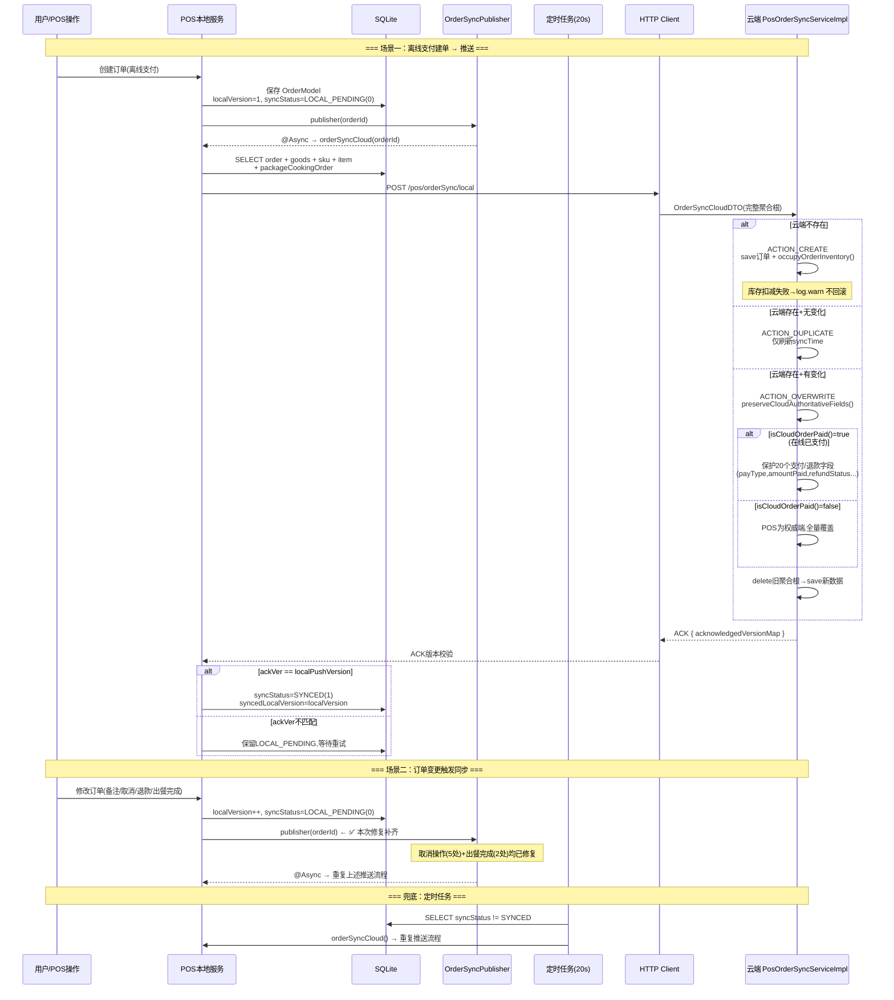
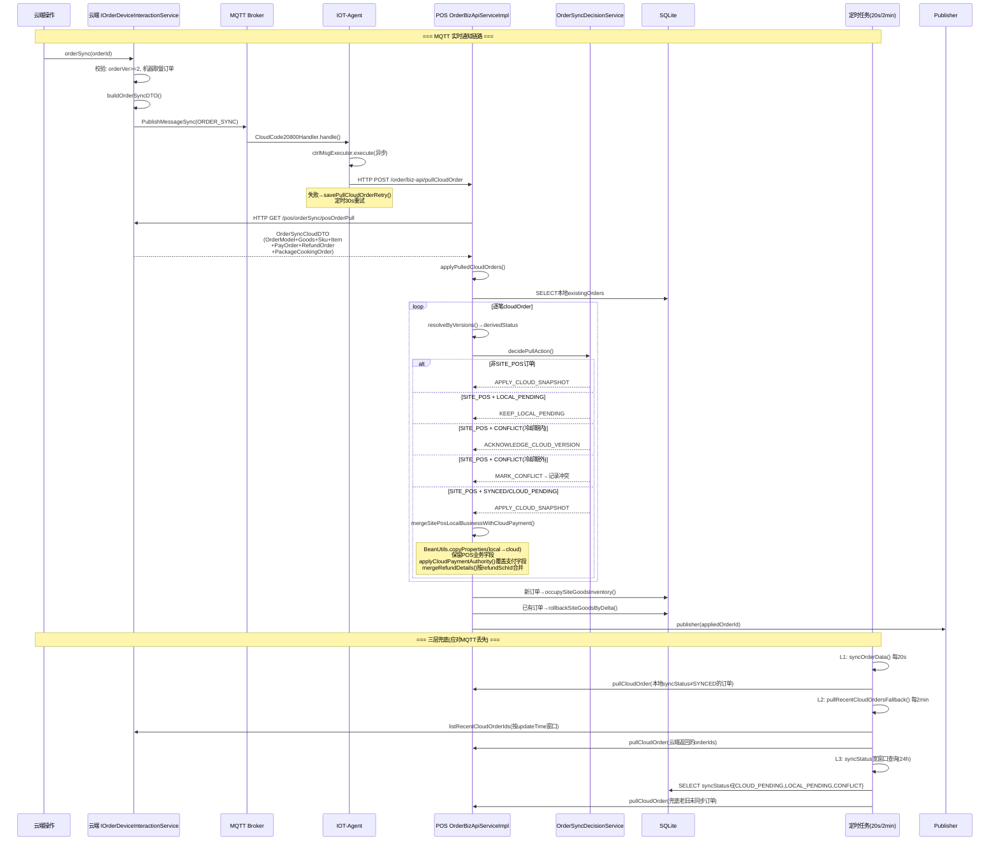
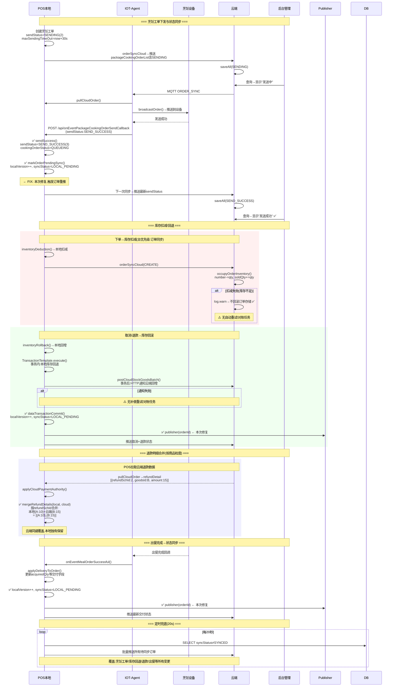

# 当前版本订单同步机制流程

---

## 图一：POS → Cloud 推送同步（场景一/二）

---

## 图二：Cloud → POS 下拉同步（场景三）

---

## 图三：关联业务同步（库存/退款/烹饪工单）

---

### 图例说明

| 标记 | 含义 |
| --- | --- |
| ✅ | 本次会话已修复 |
| ⚠️ | 已知遗留问题（库存对账缺失） |
| 🔵 实线 | 同步调用 |
| 🔴 虚线 | 异步/事件驱动 |
| 🟢 绿色区域 | 库存操作 |
| 🔵 蓝色区域 | 退款操作 |
| 🔴 红色区域 | 订单创建 |